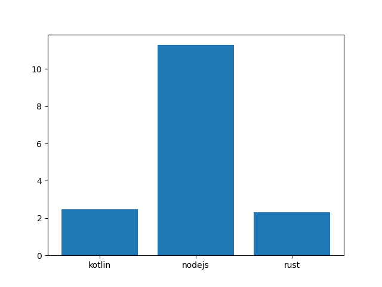

# oscillator_benchmark

Simple project that benchmarks request times for Kotin/Ktor, Rust/Rocket and NodeJS/Express.

The experiment was originally going to be using a few common oscillators for MACD and RSI but I settled
on just using standard deviation for simplicity and time. 


The plot below show the total time in seconds for 1,000 iterations * 10,000 generated samples.  




```shell
client git:(master) ./client.py
Running Kotlin sample
Kotlin Took 2.4627833366394043, 24.52764058113098
Running NodeJS Sample
NodeJS Took 11.289500951766968, 112.53042364120483
Running Rust Sample
Rust Times 2.302924871444702, 22.945704460144043

```
